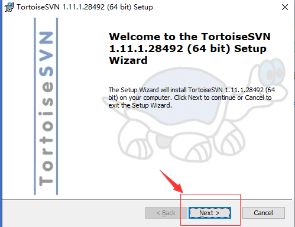
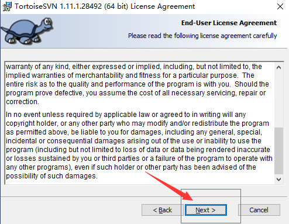
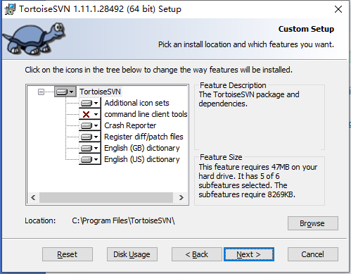
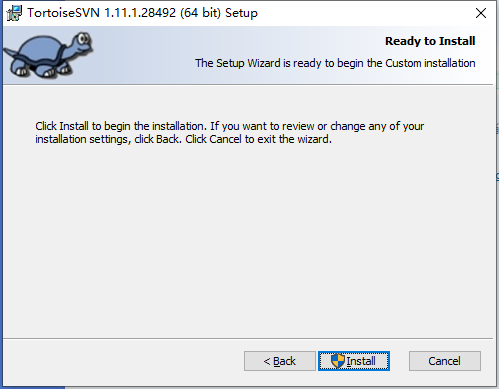
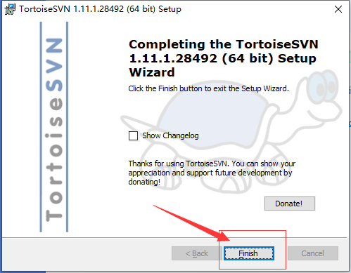
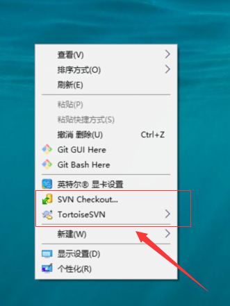
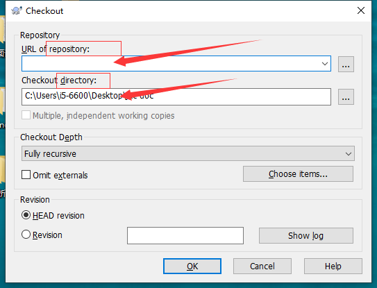

# svn如何使用？

该文章针对于windows操作系统的设计、产品等同事。

## svn介绍

`svn`全名Subversion(版本控制系统)， 是一个跨平台的软件， 支持大多数常见的操作系统。
作为一个开源的版本控制系统，`svn`管理着随时间改变的数据。这些数据放置在一个中央资料档案库(repository)中。
这个档案库很像一个普通的文件服务器，不过它会记住每一次文件的变动。
这样你就可以把档案恢复到旧的版本，或是浏览文件的变动历史。
`svn`是一个通用系统，可用来管理任何类型的文件，其中包括了程序源码。

### svn的一些概念

- `repository`(源代码库)：源代码统一存放的地方
- `Checkout`(提取)：当你手上没有源代码的时候，你需要从`repository` `Checkout`一份
- `Commit`(提交)：已经修改了代码，你就需要`Commit`到`repository`
- `Update`(更新)：当你已经`Checkout`了一份源代码，`Update`一下你就可以和`respository`上的源代码同步，你手上的代码就会最新的变更

## 日常

日常是这样子的：
    假设你已经`Checkout`并且已经工作了几天，
    `Update`获得最新的代码，
    做出自己的修改(增、删、改)，
    `Commit`大家就可以看到你的修改了

## 安装

`TortoiseSVN`是`svn`的一个免费开源客户端。 [下载地址](https://tortoisesvn.net/downloads.zh.html)。
根据你的系统版本下载对应软件。

双击已下载成功的文件(应该是`.msi`的后缀名)。

这样就安装完毕。接下来我们需要验证是否安装成功。
我们将鼠标放置桌面空白地方点击右键，菜单中是否显示下图功能，如有显示则表示已安装成功了。

`TortoiseSVN`是可以设置中文语言的，如需要设置，自行百度设置。
这里我不建议安装中文包，可以强迫学习英文。

## 使用

在任何你喜欢的地方新增一个文件夹，例如`test`。
点击进入`test`文件夹，鼠标右键选中`SVN Checkout`功能。

会出现一个弹窗，找到关键词`repository`以及`directory`。

- `repository`：`svn`的服务器地址(例如：后台程序员给的`http://xx.xx.xx.xx`)
- `directory`：则是将服务器仓库中的文件们放入你本地电脑的什么位置

剩余的选项可以不用选择，当然你如果好奇可以翻译一下是什么功能。然后，点击`OK`。

接下来你就可以在`test`文件夹中做出你的操作了(增删改等)。

操作完后鼠标右键选择`SVN Update`，完成后再选择`SVN Commit`，就提交至服务器仓库了。其余同事在自己电脑`SVN Update`就可以看到你的相关操作了。